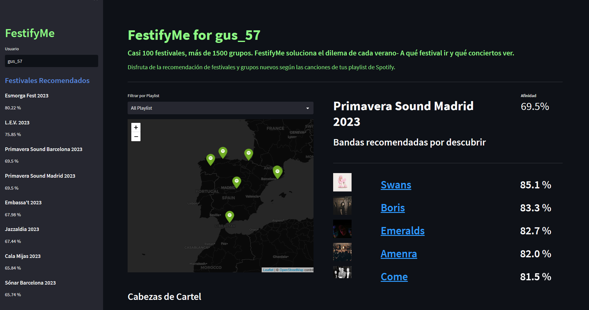

# FestifyMe

    

## Indice:
1.[📜 Descripción](#descripcion)\
2.[💡 Definición del problema](#problema)\
3.[⏳ Desarrollo](#desarrollo)\
4.[📈 Resultado](#resultado)\
5.[⏭️ Próximos Pasos](#next)\
5.[📁 Estructura](#Estructura)

## Descripción:<a name="descripcion"/>

FestifyMe es una app que te recomienda festivales de música en función de las 
playlist públicas de tu usario Spotify. Entre los casi 100 festivales que examina,
la app te recomendará 8 festivales por cada playlist. Además por cada festival 
propuesto, también te sugerirá 5 bandas que no se encuentran en tus playlist.

<video src="./images/FestifyMe.mp4" controls title="Title"></video>

